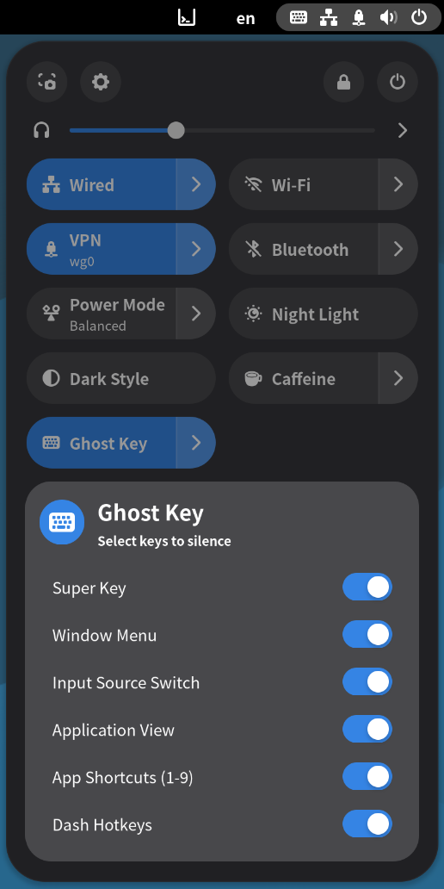

# Ghost Key Extension

A GNOME Shell extension that temporarily silences system hotkeys, perfect for gaming or presentations where you don't want system shortcuts interfering.

## Features

- **Quick Settings Toggle**: Toggle Ghost Mode on/off from the system menu
- **Selective Key Disabling**: Choose which keys to disable via the menu
- **Automatic Backup & Restore**: Remembers your original keybindings and restores them when Ghost Mode is disabled
- **Persistent Settings**: Your key selection preferences are saved between sessions

## Keys That Can Be Silenced

1. **Overlay Key** - The overlay key (Super/Windows key)
2. **Window Menu** - Alt+Space menu activation
3. **Input Source Switch** - Keyboard layout switching shortcuts
4. **Application View** - Toggle application overview
5. **App Shortcuts (1-9)** - Number keys that switch between applications

## Screenshot



## Installation

### From Source

1. Clone or download this repository to your GNOME extensions directory:
   ```bash
   git clone git@github.com:zmzhang8/ghostkey.git ~/.local/share/gnome-shell/extensions/ghostkey@zhaoming.win
   ```

2. Compile the settings schema:
   ```bash
   cd ~/.local/share/gnome-shell/extensions/ghostkey@zhaoming.win
   glib-compile-schemas --strict schemas/
   ```
3. Restart GNOME Shell (X11: Alt+F2, type `r`, press Enter; Wayland: log out and back in)

4. Enable the extension:
   ```bash
   gnome-extensions enable ghostkey@zhaoming.win
   ```

### From GNOME Extensions Website

_(Coming soon)_

## Usage

1. Open the system menu in the top-right corner
2. Click on the **Ghost Key** toggle to enable Ghost Mode
3. Click on the indicator icon (keyboard-hide) to open the menu
4. Select which keys you want to disable using the toggles
5. Click the toggle again to disable Ghost Mode and restore your keys

## Safety Features

- **Crash Recovery**: If GNOME Shell crashes while Ghost Mode is active, the extension detects this on next startup and resets safely
- **Backup Verification**: Original keybindings are always backed up before disabling
- **Graceful Disable**: When the extension is disabled, Ghost Mode is automatically turned off and keys are restored
- **Error Handling**: Individual key failures don't prevent other keys from being silenced/restored

## Requirements

- GNOME Shell 48 or later

## Development

### File Structure

```
ghostkey@zhaoming.win/
├── constants.js          # Schema definitions, keybinding descriptors, logger
├── keyManager.js         # Schema resolution, backup, silencing, restore, crash recovery
├── indicator.js          # QuickSettings indicator, toggle button, and submenu
├── extension.js          # Extension entry point & lifecycle management
├── metadata.json         # Extension metadata
├── stylesheet.css        # Custom styles (if needed)
├── schemas/
│   ├── org.gnome.shell.extensions.ghostkey.gschema.xml  # Settings schema
│   └── gschemas.compiled                                # Compiled schema binary
├── test/
│   ├── mockSettings.js   # Pure JS GSettings mock for testing
│   └── test_manager.js   # Automated unit test suite (run with gjs)
└── README.md            # This file
```

### Debug Logging

The extension logs to the GNOME Shell journal. View logs with:
```bash
journalctl -f -o cat /usr/bin/gnome-shell | grep GhostKey
```

### Contributing

Pull requests are welcome! Please ensure:
- Code follows GNOME Shell extension conventions
- Error handling is added for all gsettings operations

